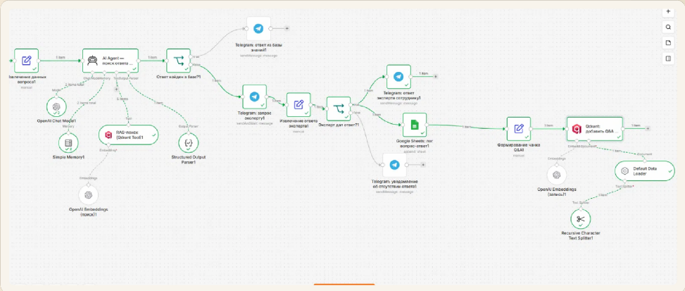
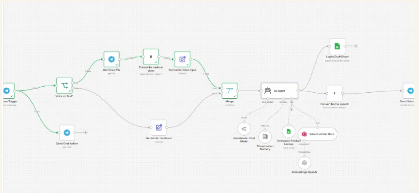
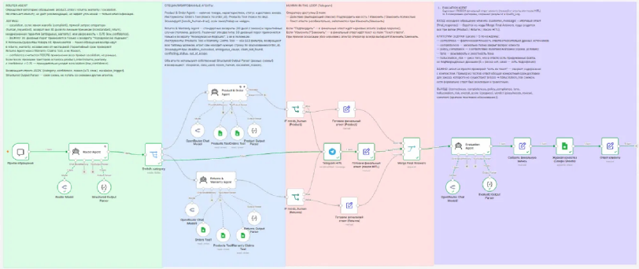
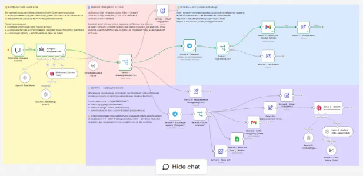
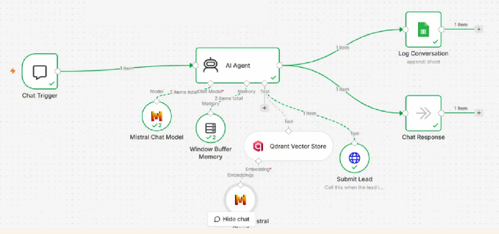

# AI Automation Portfolio

## Oleksandra Stepanova
### AI Automation & Business Process Design

> **Turning business problems into practical AI-powered workflows.**

I combine business thinking, process analysis and AI automation to identify repetitive tasks, design practical solutions and turn them into working workflows.

**From business problem → to measurable, implementable AI solution.**

---

## What I Do

- Business Process Analysis
- AI Automation
- Workflow Design
- AI Agents
- RAG & Knowledge Retrieval
- Process Optimization
- Privacy & AI Risk Controls
- Human-in-the-Loop Workflows
- AI Evaluation & Monitoring

---

## How I Approach a Business Problem

1. **Understand** — Business context · Goals · Users · Constraints
2. **Analyze** — AS-IS process · Pain points · Bottlenecks
3. **Identify** — AI opportunities · Automation potential
4. **Prioritize** — Business value · Feasibility · Risk
5. **Design** — TO-BE process · AI architecture · Workflow
6. **Model the economics** — ROI · TCO · Payback · Business value
7. **Automate** — n8n · AI Agents · Integrations
8. **Govern** — GDPR · Compliance · Evaluation · Monitoring

---

# Featured Projects

## 01 · Internal Knowledge
### AI Knowledge Assistant with Human-in-the-Loop
Employees receive answers from a RAG knowledge base; unanswered questions are escalated to an expert and converted into reusable organizational knowledge.

[**View project →**](projects/01-internal-knowledge/)

---

## 02 · Voice Interface
### AI Voice Support Agent
A multilingual voice/text interface for fast product-information lookup and automated responses.

[**View project →**](projects/02-voice-interface/)

---

## 03 · E-Commerce Support
### AI Multi-Agent Support System
A coordinated support architecture with a Router Agent, specialized agents, human escalation and automated quality control.

[**View project →**](projects/03-ecommerce-support/)

---

## 04 · Privacy & Compliance
### Privacy-Safe LLM Workflow
PII detection, tokenization and a risk gate protect sensitive information before LLM processing.

[**View project →**](projects/04-privacy-compliance/)

---

## 05 · Legal Operations
### AI Legal Navigator
An AI entry point that classifies requests and routes them to specialized workflows, knowledge retrieval or human escalation.

[**View project →**](projects/05-legal-operations/)

---

## 06 · Customer Feedback
### AI Feedback Triage
Incoming feedback is validated, analyzed and assigned a confidence / priority level to determine autonomous handling or human review.

[**View project →**](projects/06-customer-feedback/)

---

## 07 · Lead Generation
### Lead Generation & AI Qualification
AI conversations are transformed into structured lead data using RAG, intent analysis and lead qualification.

[**View project →**](projects/07-lead-generation/)

---

# Supporting Workflows

### Lead Delivery
Submitted lead data is delivered through a webhook to Google Sheets, Gmail and Telegram.

[**View project →**](projects/08-lead-delivery/)

### AI Response Quality Control
Scheduled test cases are evaluated by a Judge Agent; scores are logged and alerts can be triggered when quality falls below a threshold.

[**View project →**](projects/09-quality-control/)

---

# Technology

**Automation**
`n8n`

**AI / LLM**
`OpenAI` · `OpenRouter` · `ChatGPT-4` · `AI Agents`

**Knowledge & Retrieval**
`RAG` · `Qdrant` · `OpenAI Embeddings` · `Vector Store`

**Integrations**
`Telegram` · `Gmail` · `Google Sheets` · `Webhooks`

**Governance & Quality**
`PII Tokenization` · `Risk Gates` · `Human-in-the-Loop` · `Judge Agents` · `Evaluation` · `Monitoring`

---

## Portfolio Scope

The projects in this portfolio demonstrate practical workflow design across:

- Internal knowledge management
- Voice-first support
- E-commerce customer support
- Privacy-aware LLM processing
- Legal operations
- Customer feedback triage
- Lead generation and qualification
- Lead delivery
- AI response evaluation

---

## About

**Oleksandra Stepanova**  
AI Automation & Business Process Design

I combine business thinking, process analysis and AI automation to identify repetitive tasks, design practical solutions and turn them into working workflows.

