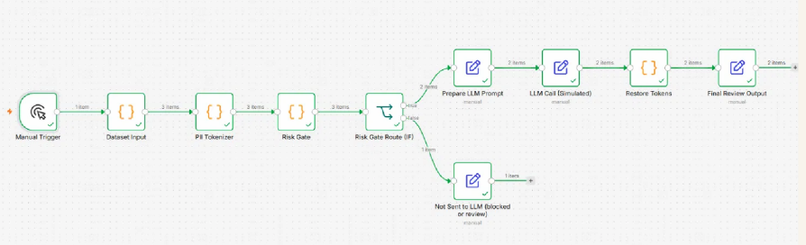

# Privacy-Safe LLM Workflow

## Protecting Sensitive Data Before AI Processing

A privacy-safe LLM workflow that protects sensitive information before it reaches the AI model.

## Problem

AI workflows may process datasets containing personally identifiable information (PII).

Sensitive data needs to be protected before LLM processing.

## Solution

The workflow detects and tokenizes PII before sending data to the LLM.

A risk gate determines whether processing is safe to continue.

Unsafe cases are blocked or sent for human review.

After successful LLM processing, the original values can be restored from their tokens.

## Workflow

Dataset
↓
PII Detection / Tokenization
↓
Risk Gate
↓
Safe → LLM Processing → Restore Tokens → Final Output
↓
Not Safe → Blocked / Human Review

## Architecture

## Technologies

- n8n
- LLM
- PII detection and tokenization
- Risk Gate
- Human Review

## Business Value

- Protect sensitive information before AI processing
- Introduce a safety gate before LLM access
- Block unsafe processing
- Enable human review for risky cases
- Restore protected data after processing

## Key Concepts

Privacy · PII Protection · Tokenization · Risk Gate · LLM Security · Human-in-the-Loop

