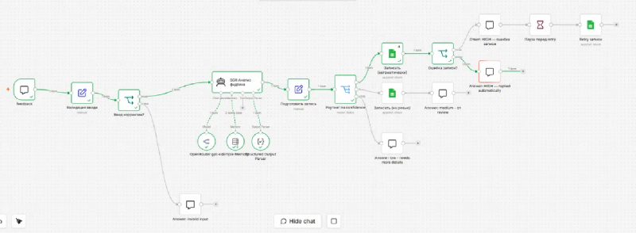

# AI Feedback Triage

## AI-Powered Customer Feedback Triage

An AI workflow for analyzing customer feedback, assessing confidence and routing cases based on the quality of the AI result.

## Problem

Customer feedback needs to be reviewed and classified before an appropriate response can be prepared.

Manual processing can make this workflow time-consuming.

## Solution

The workflow validates incoming feedback and uses AI to analyze it.

The result is assessed by confidence:

- High confidence → automated response
- Medium confidence → human review
- Low confidence → request more information

Every result is logged in Google Sheets.

## Workflow

Customer Feedback
↓
Input Validation
↓
AI Analysis
↓
Confidence Assessment
↓
High → Automated Response
Medium → Human Review
Low → Request More Information
↓
Google Sheets Log

## Architecture

## Technologies

- n8n
- OpenRouter
- AI Agent
- Google Sheets

## Business Value

- Automate initial feedback analysis
- Route cases according to AI confidence
- Keep human review for uncertain cases
- Maintain a structured log of results

## Key Concepts

AI Feedback Analysis · Confidence Assessment · Human-in-the-Loop · Automated Routing · n8n
