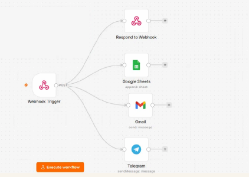

# Lead Delivery

## Automated Lead Delivery

A workflow that delivers structured lead data to multiple business channels simultaneously.

## Workflow

Qualified Lead
↓
Webhook
↓
Google Sheets
+
Gmail
+
Telegram

## Solution

Submitted lead data is received through a webhook and delivered simultaneously to:

- Google Sheets
- Gmail
- Telegram

This provides structured storage and immediate delivery to business communication channels.

## Architecture

## Technologies

- n8n
- Webhooks
- Google Sheets
- Gmail
- Telegram

## Business Value

- Automate lead delivery
- Send lead information to multiple channels simultaneously
- Keep structured lead data in Google Sheets
- Provide immediate notifications through email and Telegram

## Key Concepts

Webhooks · Lead Delivery · Workflow Automation · Multi-Channel Communication · n8n

