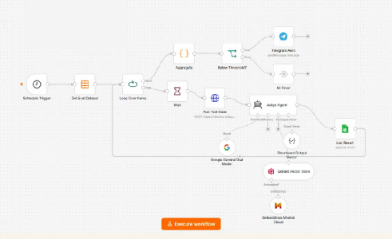

# AI Quality Control

## Automated AI Response Evaluation

A scheduled workflow for testing AI agent responses and automatically evaluating their quality.

## Problem

AI agents need continuous quality control to identify low-quality responses and maintain reliable performance.

## Solution

The workflow periodically runs predefined test cases against an AI agent.

A Judge Agent evaluates each answer using the knowledge base and assigns a score.

Results are logged, and an alert is triggered when the score falls below the defined threshold.

## Workflow

Scheduled Test Run
↓
Test Cases
↓
AI Agent
↓
Judge Agent
↓
Knowledge Base
↓
Score
↓
Quality Log
↓
Alert if Score < Threshold

## Architecture

## Technologies

- n8n
- Judge Agent
- Qdrant
- Embeddings
- Google Sheets
- Webhooks
- Gmail
- Telegram

## Business Value

- Automate AI response testing
- Evaluate responses against a knowledge base
- Track quality scores
- Detect low-quality responses
- Trigger alerts when quality falls below the threshold

## Key Concepts

Automated Testing · AI Evaluation · Judge Agent · Quality Control · Knowledge Grounding · Monitoring
